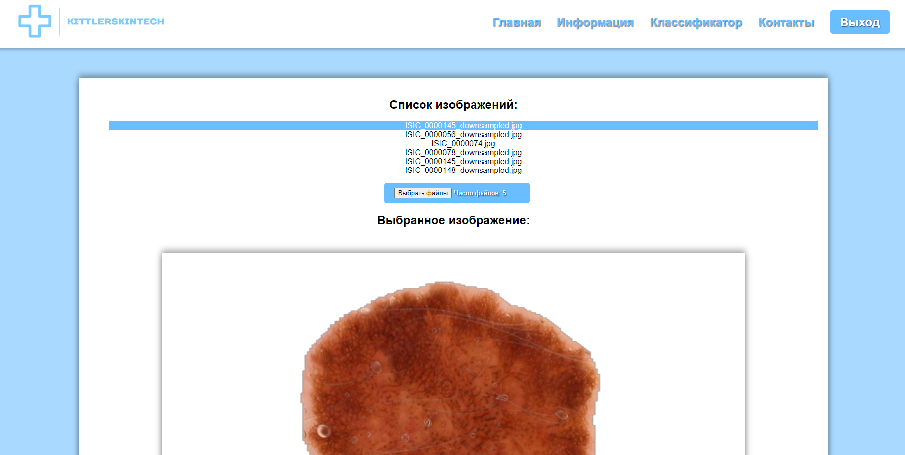
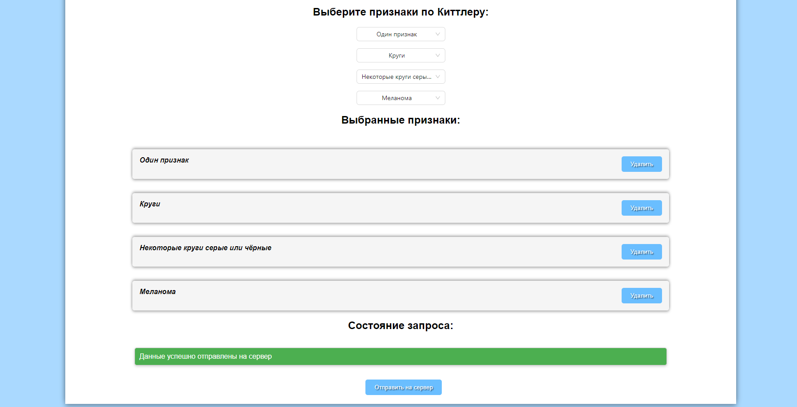

# Web_images
Web version for desktop app, for making label for images

## Caselab_Kittler_Img_Analysis
Проект "Caselab_Kittler_Img_Analysis" - это веб-приложение, разработанное для выявления признаков Киттлера на изображениях новообразований кожи. Приложение отправляет изображения на сервер для анализа и сохранения результатов.

## Особенности

- Регистрация пользователей
- 

- Интерфейс для загрузки и отправки изображений на сервер.
- 
  
- Сохранение результатов анализа.
- 

## Ссылка на проект

Ссылка на проект: 

## Инструкции по началу работы

Чтобы начать использовать проект, выполните следующие инструкции:

1. Клонируйте этот репозиторий на свой компьютер.
2. Запустите серверную часть проекта на сервере.
3. Откройте веб-приложение в вашем веб-браузере, следуя инструкциям по развертыванию на сервере.

## Использование

- Загрузите изображение новообразования кожи в веб-приложение.
- Выбирайте признаки Киттлера, согласно дереву решений.
- Просматривайте результаты анализа и сохраняйте их при необходимости.

## Используемые технологии

- HTML
- CSS
- JavaScript
- React
- Серверная часть Python для обработки и хранения изображений и результатов анализа.

## Автор

- Ульяна 
- Артур
